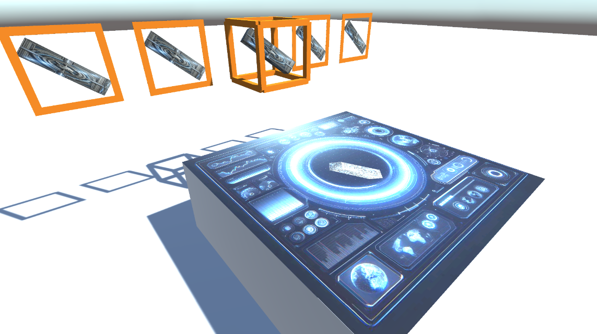

# Unity Scaling Effects Project

This Unity project demonstrates two alternative implementations based on performance and visual needs.

## Effect 1: Render Texture

This effect creates a render texture to achieve the appearance of an object on a surface, such as a table. To implement this:

1. Create a camera in the scene.
2. Assign a render texture to the camera.
3. Set the camera to orthographic and adjust its bounds to match the surface (e.g., table).
4. Position the camera appropriately before any rotations.
5. Create a quad in the scene and apply the render texture to it, aligning it with the camera's near-plane.

To view this effect, open the main scene in Unity and observe the sci-fi cube on the table.

## Effect 2: Scaling Object in a Box

This effect gives the impression that an object is hovering inside a box, achieved by scaling along the back axis of the box. This method alters the pivot and scale axis using a custom parent object, allowing for arbitrary adjustments in 3D space. This effect is preferred when lighting alterations are acceptable and render texture usage is deemed too expensive.

To implement this:

1. Manipulate the object's pivot and scale axis by making it the child of another object which is the pivot matrix.
2. Adjust the scale along the back axis of the box close to zero, creating the desired effect.

To see this effect, open the main scene in Unity, and observe the tetrominos within the scaled box.

Choose the effect that best fits your project's requirements, balancing between visual appeal and performance considerations.
